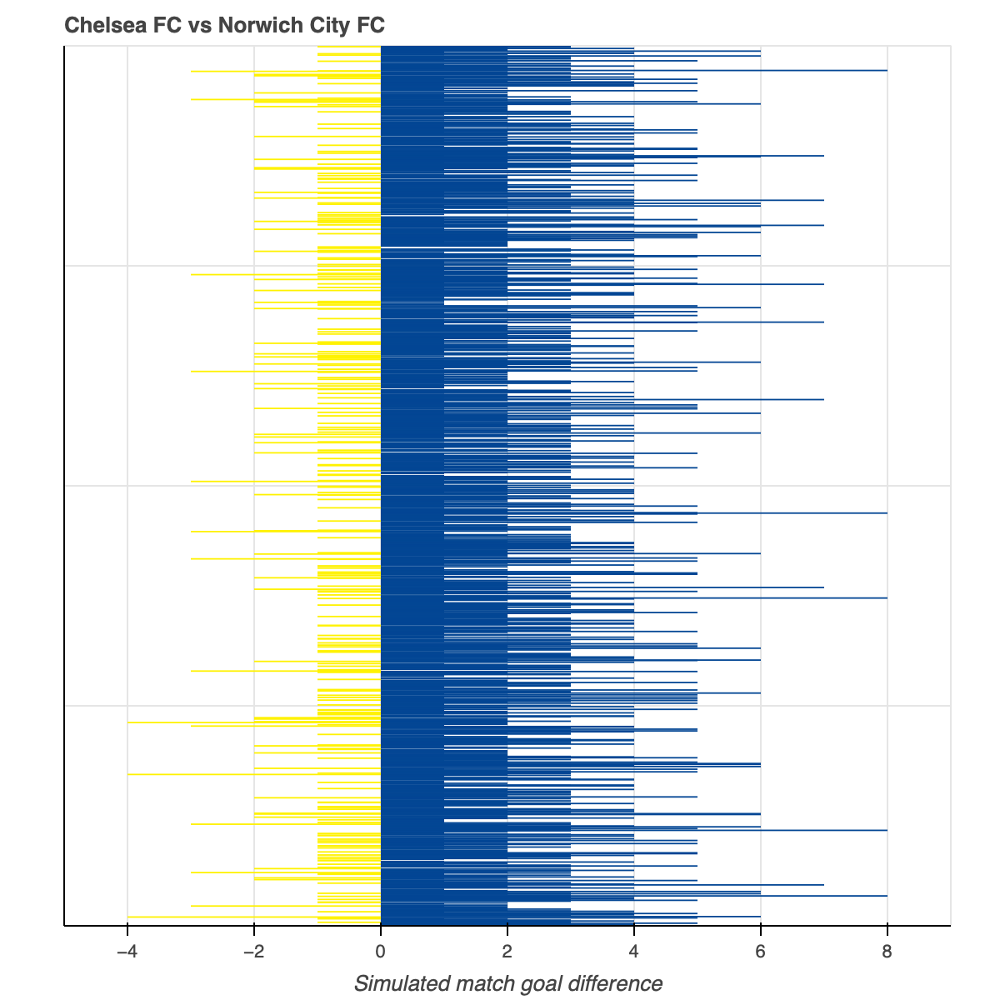

# Pyro: a guide to winning the Premier League
## Using variational inference to predict the outcomes of football matches.
### 2021-09-25

"West Ham are playing Norwich later. What do you reckon the score will be?"

Our gut might tell us which team will win. But how can we quantify this intuition? And what uncertainty do we attach to our belief in the result?

This sort of question is ideally suited to a Bayesian modelling framework. Here, we'll build a model to predict future scorelines with uncertainty based on past results using [__Pyro__](https://pyro.ai) – a "Deep Universal Probabilistic Programming" language – and make use of its PyTorch backend by tuning the model with stochastic variational inference (SVI).

## The problem
The aim is to train a model on the results of the first 33 rounds of a Premier League season. Then, use this model to predict the scorelines of the final games of the season.

No model is perfect, and this one is very basic. With data collected in modern football on everything from player movement to the atmospheric conditions inside the stadium, the potential complexity of the model is huge. We'll stick to three factors: the attacking strength of each team; the defending strength of each team; and the home advantage.

## The model
This __Bayesian multilevel model__ is (heavily) inspired by [Baio and Blangiardo](https://discovery.ucl.ac.uk/id/eprint/16040/1/16040.pdf). For each game, $g$, the number of goals scored, $s$, by the home ($j=1$) or away ($j=2$) team follows a Poisson distribution
$$ s_{gj} | \theta_{gj} \sim Poisson(\theta_{gj}). $$

The (positive) scoring rates are made up of an overall offset, a home advantage and team-specific strengths,
$$ \log(\theta_{g1}) = \alpha + home + attack_{h(g)} - defend_{a(g)}, $$
$$ \log(\theta_{g2}) = \alpha + attack_{a(g)} - defend_{h(g)}, $$

where the nested indexes $h(g)$ and $a(g)$ identify the home and away teams. For each team, $t (= h(g), a(g))$, we model their attacking and defensive strength using normal distributions centred on zero with common standard deviations,
$$ attack_{t} \sim \mathcal{N}(0, \sigma_{att}^2),$$
$$ defend_{t} \sim \mathcal{N}(0, \sigma_{def}^2).$$

Finally the hyperpriors round off the Bayesian model,
$$ home \sim \mathcal{N}(0, 1),$$
$$ \sigma_{att} \sim HalfStudentT(3, 0, 2.5),$$
$$ \sigma_{def} \sim HalfStudentT(3, 0, 2.5).$$

The model written using Pyro:
```python
def model(home_id, away_id, score1_obs=None, score2_obs=None):
    # hyperpriors
    alpha = pyro.sample("alpha", dist.Normal(0.0, 1.0))
    sd_att = pyro.sample("sd_att", dist.TransformedDistribution(dist.StudentT(3.0, 0.0, 2.5), FoldedTransform()))
    sd_def = pyro.sample("sd_def", dist.TransformedDistribution(dist.StudentT(3.0, 0.0, 2.5), FoldedTransform()))

    home = pyro.sample("home", dist.Normal(0.0, 1.0))  # home advantage

    nt = len(np.unique(home_id))

    # team-specific model parameters
    with pyro.plate("plate_teams", nt):
        attack = pyro.sample("attack", dist.Normal(0, sd_att))
        defend = pyro.sample("defend", dist.Normal(0, sd_def))

    # likelihood
    theta1 = torch.exp(alpha + home + attack[home_id] - defend[away_id])
    theta2 = torch.exp(alpha + attack[away_id] - defend[home_id])

    with pyro.plate("data", len(home_id)):
        pyro.sample("s1", dist.Poisson(theta1), obs=score1_obs)
        pyro.sample("s2", dist.Poisson(theta2), obs=score2_obs)
```

## Inference
If we were tuning our model parameters using sampling methods, that would be it. Press play, let the sampler run, wait until you have enough samples... done. But we're going to use [__variational inference__](http://pyro.ai/examples/svi_part_i.html) to optimise our parameters. For this, Pyro requires a __guide__.

### The guide
The idea behind variational inference is to approximate a complex distribution – our true posterior, $p(\mathbf{z}|\mathbf{x})$ – with a simpler one – the variational distribtion, $q(\mathbf{z})$. In Pyro-speak, the variational distribution is called the _guide_.

_If possible, let Pyro do the process for you with an [AutoGuide](https://docs.pyro.ai/en/stable/infer.autoguide.html). Designing a custom guide is by far the hardest part of using Pyro and it should be avoided._

We need to specify a guide that is flexible enough to closely describe the posterior. Often, we can simply micic the model prior, setting the parameters of each of the prior distributions as variational parameters, which we will learn. But you are free to customise the guide as you want, as long as the dimensionality of the model and guide are consistent.

When writing a guide:
- Every `pyro.sample` statement that appears in the model must have a __corresponding `pyro.sample` statement with the same name in the guide__, with the expection of those with the `obs` keyword .
- The parameters that make up the `pyro.sample` distributions in the guide require their own `pyro.param` statements. These __variational parameters__ are going to be trained during inference.

I've kept the guide below fairly simple with normal distributions where possible and log-normal distributions for the positive parameters. __SVI is an approximate method__; these simple distributions will mask some of the complexity in the posterior distribution, no matter how well the inference goes. You can construct a more sophisticated guide to improve its performance.

```python
def guide(home_id, away_id, score1_obs=None, score2_obs=None):
    mu_locs = pyro.param("mu_loc", torch.tensor(0.0).expand(4))
    mu_scales = pyro.param("mu_scale", torch.tensor(0.1).expand(4), constraint=constraints.positive)

    pyro.sample("alpha", dist.Normal(mu_locs[0], mu_scales[0]))
    pyro.sample("sd_att", dist.LogNormal(mu_locs[1], mu_scales[1]))
    pyro.sample("sd_def", dist.LogNormal(mu_locs[2], mu_scales[2]))
    pyro.sample("home", dist.Normal(mu_locs[3], mu_scales[3]))  # home advantage

    nt = len(np.unique(home_id))

    mu_team_locs = pyro.param("mu_team_loc", torch.tensor(0.0).expand(2, nt))
    mu_team_scales = pyro.param("mu_team_scale", torch.tensor(0.1).expand(2, nt), constraint=constraints.positive)

    with pyro.plate("plate_teams", nt):
        pyro.sample("attack", dist.Normal(mu_team_locs[0], mu_team_scales[0]))
        pyro.sample("defend", dist.Normal(mu_team_locs[1], mu_team_scales[1]))
```

We can now train the model using SVI on the first 33 rounds of Premier League football matches. The training process aims to find the `pyro.param` values that get the guide as close as possible to the posterior.

Below are posterior estimates for the `attack` and `defend` parameters. As expected, Manchester City and Liverpool are the strongest teams.

<embed type="text/html" src="fig/team_strengths.html" width="800" height="620"></embed>

## Prediction
Here lies the beauty of a generative model. We can now feed any combination of teams into the trained model and __simulate a game__. (You can even play out nonsenical matches like Machester United against Manchester United.)

The model is Bayesian, so we can generate samples for a fixture – imaginary head-to-heads between the same two teams – and probabilistically determine each team's chance of winning the match. We'll input the fixture list of the final 5 rounds of matches in the `predict` dataframe and simulate 2000 games.
```python
predictive = Predictive(model=model, guide=guide, num_samples=2000, return_sites=["s1", "s2"])
predicted_score = predictive(home_id=predict["Home_id"].values, away_id=predict["Away_id"].values)
```

Taking an example from this fixture list – Chelsea hosting Norwich – we can see that Chelsea dominated the majority of the matches. We expect this as Chelsea have the home advantage and a stronger side. But, as the model is probabilistic, there are still many scenarios in which Norwich came out on top.


Using the mean number of goals scored by each team across all simulations, we can compare the true final table and our model predictions.
	
| Team                       | Points | GD  | Predicted Points | Predicted GD |
|----------------------------|--------|-----|------------------|--------------|
| Liverpool FC               | 99     | 52  | 104              | 52           |
| Manchester City FC         | 81     | 67  | 81               | 55           |
| Manchester United FC       | 66     | 30  | 65               | 25           |
| Chelsea FC                 | 66     | 15  | 65               | 17           |
| Leicester City FC          | 62     | 26  | 73               | 37           |
| Tottenham Hotspur FC       | 59     | 14  | 56               | 9            |
| Wolverhampton Wanderers FC | 59     | 11  | 58               | 9            |
| Arsenal FC                 | 56     | 8   | 55               | 7            |
| Sheffield United FC        | 54     | 0   | 52               | 0            |
| Burnley FC                 | 54     | -7  | 50               | -10          |
| Southampton FC             | 52     | -9  | 46               | -15          |
| Everton FC                 | 49     | -12 | 54               | -6           |
| Newcastle United FC        | 44     | -20 | 46               | -13          |
| Crystal Palace FC          | 43     | -19 | 47               | -12          |
| Brighton & Hove Albion FC  | 41     | -15 | 39               | -11          |
| West Ham United FC         | 39     | -13 | 39               | -17          |
| Aston Villa FC             | 35     | -26 | 28               | -30          |
| AFC Bournemouth            | 34     | -25 | 28               | -32          |
| Watford FC                 | 34     | -28 | 30               | -26          |
| Norwich City FC            | 21     | -49 | 24               | -39          |

The model performs well on the whole. There are exceptions such as Leicester, who had a poor finish to the season that did not reflect the training data. Leicester have been weak finishers in the recent past, so one way to improve the model would be to include data from previous seasons.

_Find the working model code [here](https://github.com/theorashid/probabilistic-programming-packages/blob/main/models/python/pyro-mod.py)._

_Thanks to @martinjankowiak on the Pyro forum for all the help making this run. Find the discussion [here](https://forum.pyro.ai/t/hierarchical-model-guide-with-plate/3079)._
